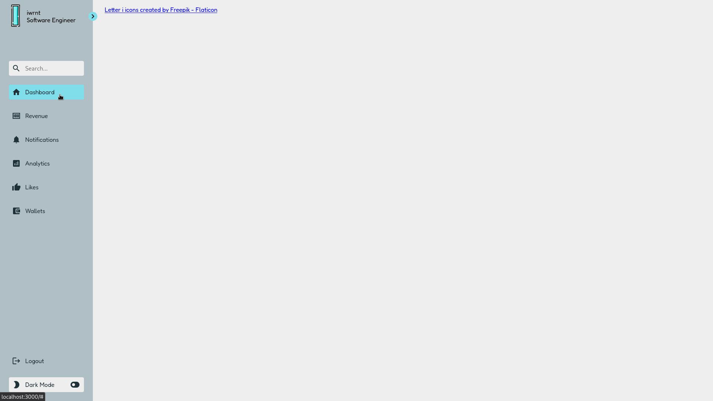
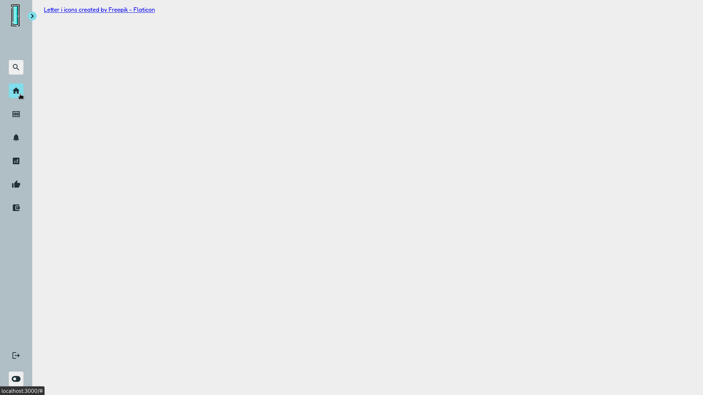
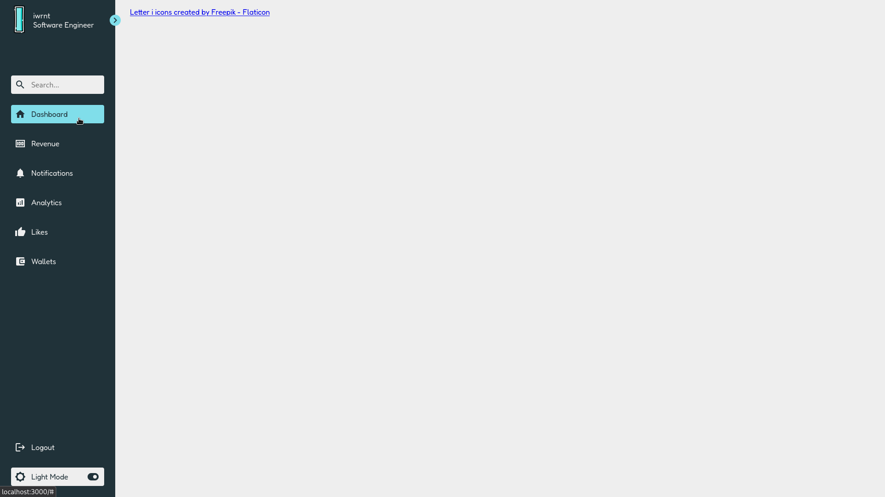
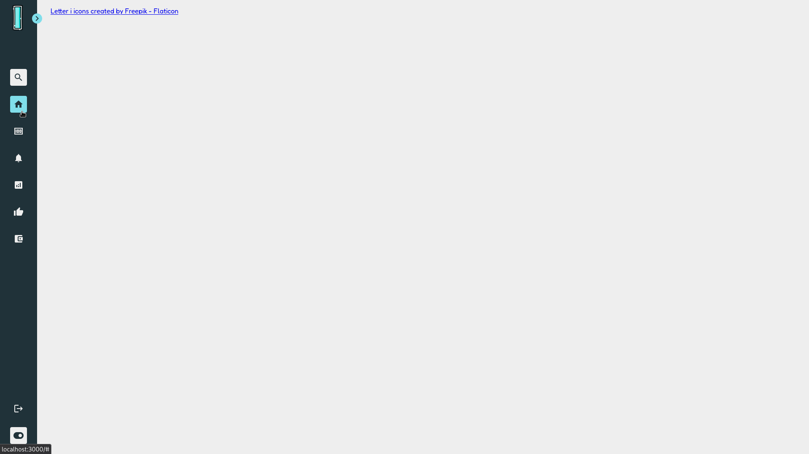

# Responsive Sidebar Menu

Hi! This is a simple project about responsive sidebar menu. I created this project to let me learn more about `css`.

This project is inspired by [this tutorial](https://www.youtube.com/watch?v=bFvfqUMjvsA).

> The logo that I used is created by [Freepik - Flaticon](https://www.flaticon.com/free-icons/letter-i).

## Features:
- Open and Close Sidebar Menu
- Light and Dark Mode Toggle

## Tools:
- HTML 5
- CSS
- Vanilla JS
- [Materialize Icon](https://materializecss.com/icons.html)

## Screenshots:
1. Expanded (Light)

2. Closed (Light)

3. Expanded (Dark)

4. Closed (Dark)
